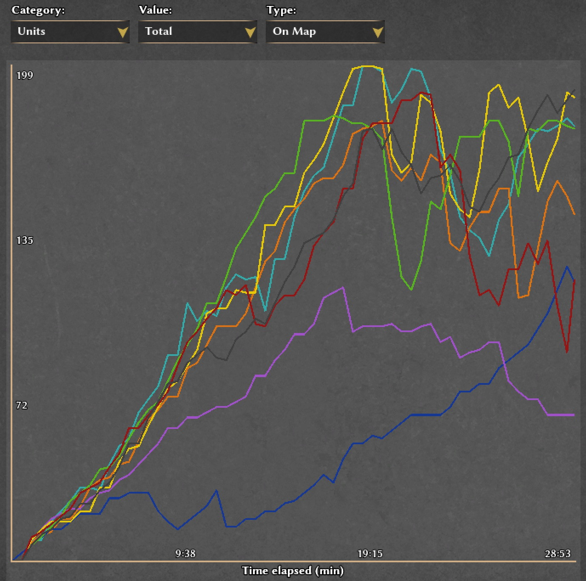

# pop-chart

Population chart mod for 0 A.D. https://play0ad.com/

## How To Install

Download zip: https://github.com/dpikt/pop-chart/archive/master.zip

### Automatic install

Right click zip file > click open with 0 A.D.

More info: https://trac.wildfiregames.com/wiki/Modding_Guide#Howtoinstallmods

### Manual install

Unzip and copy the resulting folder into the 0ad mods directory.

- Linux: `~/.local/share/0ad/mods/`
- Windows: `~\Documents\My Games\0ad\mods\`
- Mac: `~/Library/Application\ Support/0ad/mods/`

More info: https://trac.wildfiregames.com/wiki/Modding_Guide#Wherearethemods

Then enable the mod from the Mod Selection screen in 0 A.D.

## Limitations

- Calculation: This mod naively calculates total population by subtracting units killed from units trained. This is adequate for most cases but will be slightly inaccurate in maps/modes with non-standard starts (like Empire) or with civs with non-standard starting units (Mauryans and Britons). Pull requests welcome!

- Translations: I wasn't sure how to add translations for the "on map" text - if anyone can point me to the right files I'd be happy to add some.

## Credits

Thanks to fpre and badosu for the `fgod` and `balanced-maps` mods respectively - those examples were extremely helpful for getting started.
